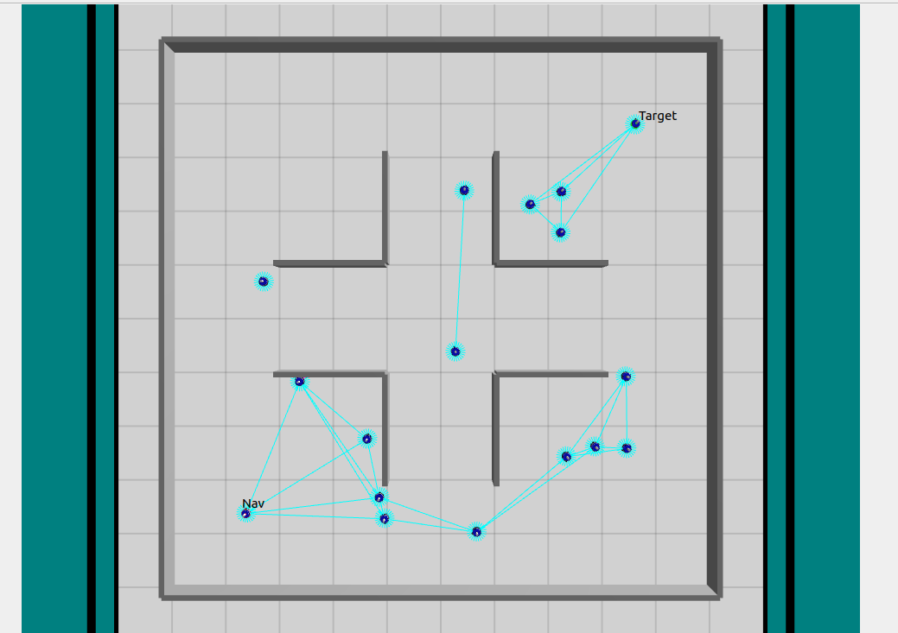
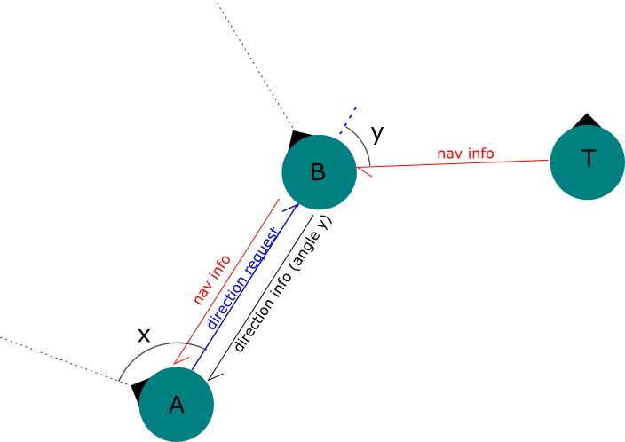
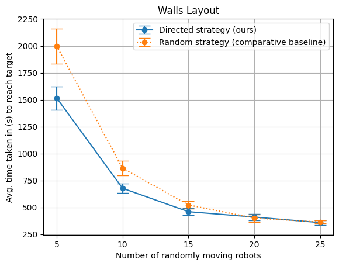

# Navigation with Direction

Directionally aided swarm navigation in ARGoS. This project extends a baseline swarm navigation algorithm by storing and reusing directional information about the target when the swarm becomes too sparse to provide reliable neighbor cues.


## Overview

This repository contains C++ controllers and experiment configurations for foot-bot robots in the ARGoS3 simulator. The goal was to improve upon the navigation approach described in [Cooperative navigation in robotic swarms](https://link.springer.com/article/10.1007/s11721-013-0089-4) by adding a simple, decentralized fallback that avoids aimless wandering in sparse swarms.

Key idea: each robot relays target information using local Range-and-Bearing (RAB) communication. When the designated navigating robot (role 2) reaches the last known waypoint and no newer information is available, it uses the last received heading toward the target instead of choosing a random direction. This reduces detours and improves robustness at low swarm densities.



See the [accompanying group report](assets/Group_Project_Paper.pdf) for motivation, experimental setup, and analysis.

## Features

- Directional Navigation controller with decentralized message passing
- Diffusion controller baseline (gas-like dispersion/avoidance)
- Sparse-swarm fallback using stored target heading
- Ready-to-run ARGoS experiment files (mazes and empty/walled maps)
- Configurable parameters via XML (velocity, ranges, roles, navigation mode)

## Repository structure

```
controllers/                 # C++ controllers
	directional_navigation/    # Directionally aided navigation (primary)
	footbot_diffusion/         # Diffusion baseline
loop_functions/              # Visualization/user functions (Qt)
experiments/                 # ARGoS .argos experiment configs
data/, data2/                # CSV environment layouts used by experiments
cmake/                       # CMake find scripts
CMakeLists.txt               # Top-level build config
Group_Project_Paper.pdf      # Project report (summary and results)
```

## How it works (high level)

- Roles (XML parameter `role` in `directional_navigation` controller):

  - 0 = swarm member (relay/nav table maintenance, random walk with avoidance)
  - 1 = target beacon (periodically increments its sequence and broadcasts)
  - 2 = navigator (goal-seeking behavior that follows best-known chain)
- Message types over RAB (see `directional_navigation.cpp`):

  - 77: navigation update (target_id, sequence_number, distance)
  - 56: request for directional info (ask neighbor for heading)
  - 25: reply with heading toward target relative to requester
- Fallback improvement: when the navigator exhausts the queued waypoint (no closer update available), it prefers the most recently received heading (if available) instead of a random heading. Only if none is available does it fall back to random or stop based on `navigation_type`.

## Build

Prerequisites:

- ARGoS3 (core and plugins for foot-bot, RAB, LEDs, proximity)
- CMake 3.8+
- A C++17 compiler

Notes:

- ARGoS is best supported on Linux/macOS. On Windows, using WSL is recommended. If building natively on Windows, ensure ARGoS and its plugins are installed and discoverable by CMake (`CMAKE_PREFIX_PATH`).

Build steps:

```powershell
mkdir build
cd build
cmake ..
cmake --build .
```

If CMake cannot find ARGoS, set `CMAKE_PREFIX_PATH` to your ARGoS install prefix before running CMake.

## Run experiments

Use ARGoS to launch any configuration in `experiments/`.

```powershell
argos3 -c experiments/maze_2Ls_directional_navigation.argos
argos3 -c experiments/maze_4Ls_directional_navigation.argos
argos3 -c experiments/swarmnavigationdirection.argos
```

The non-"directional" `.argos` files run baseline controllers for comparison.

## Results summary


Qualitatively, the directional fallback reduces time spent wandering when the swarm is sparse and lowers failure cases where the navigator leaves the productive corridor. Quantitative results, experiment layouts, and procedures are detailed in `Group_Project_Paper.pdf`.

## Reference

- Pinciroli, C., Trianni, V., O'Grady, R., et al. (2013). ARGoS: a modular, multi-engine robot simulator. Swarm Intelligence, 7, 55–79. https://doi.org/10.1007/s11721-013-0089-4

## License

MIT License. See `LICENSE`.

## Acknowledgments

- Built on ARGoS examples and APIs for foot-bot sensors/actuators
- Group project; code organization and the directional fallback implementation developed primarily by the repository owner
